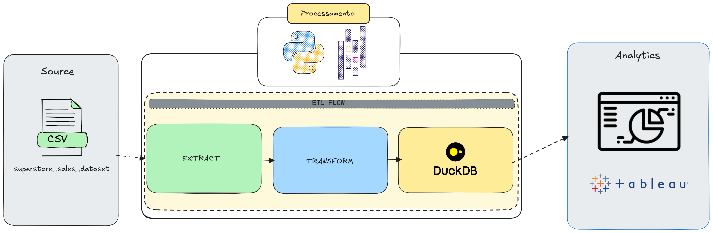
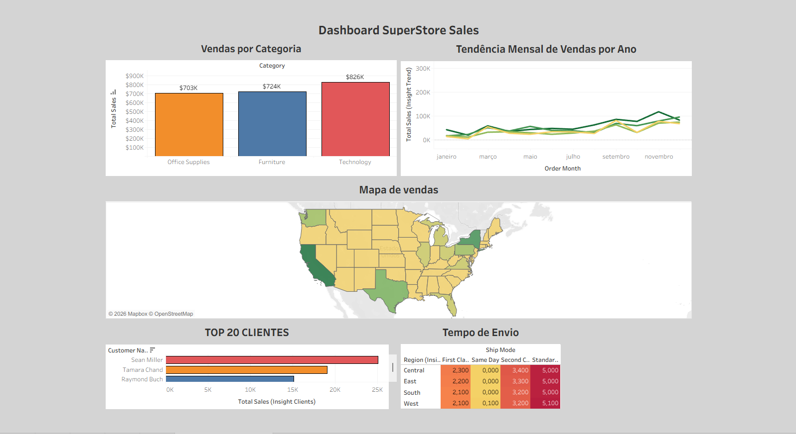

# 📊 Pipeline Analítico com DuckDB e Tableau — Superstore Sales

Pipeline ETL completo com análise de dados e dashboard interativo, construído com Python, DuckDB e Tableau. Dataset real de vendas da Superstore com 9.800 transações entre 2014 e 2017.

---

## 📋 Sobre o Projeto

Este projeto responde a uma necessidade real de negócio: transformar dados brutos de vendas em insights acionáveis para a tomada de decisão.

O pipeline extrai e transforma os dados com Python, carrega num warehouse analítico local com DuckDB, gera 5 tabelas de insights com SQL e visualiza tudo num dashboard interativo no Tableau.

---

## 🏗️ Arquitetura


---

## 🛠️ Stack Tecnológica

| Ferramenta | Papel                                           |
| ---------- | ----------------------------------------------- |
| Python     | Extração e transformação dos dados              |
| DuckDB     | Warehouse analítico local — queries SQL rápidas |
| pandas     | Manipulação de DataFrames                       |
| Tableau    | Visualização e dashboard                        |
| SQL        | Queries analíticas e geração de insights        |

---

## 📁 Estrutura do Projeto

```
project4_analytics/
│
├── data/
│   ├── raw/
│   │   └── superstore_sales_dataset.csv              # Dataset original Superstore
│   └── processed/
│       └── superstore.duckdb                         # Warehouse analítico local
│
├── etl/
│   ├── extract.py                                    # Leitura do CSV
│   ├── transform.py                                  # Limpeza e enriquecimento
│   └── load.py                                       # Carga no DuckDB
│
├── insights/
│   └── queries.py                                    # Queries analíticas → tabelas DuckDB
│
├── requirements.txt
├── .gitignore
└── README.md
```

---

## 🗄️ Tabelas no DuckDB

|Tabela|Descrição|
|---|---|
|`vendas_limpas`|Dados transformados e enriquecidos|
|`insight_sales_by_category`|Vendas por categoria e subcategoria|
|`insight_trend`|Tendência mensal de vendas por ano|
|`insight_geography`|Vendas por região e estado|
|`insight_clients`|Top 20 clientes por volume de vendas|
|`insight_operations`|Tempo médio de envio por modo e região|

---

## 📈 Transformações aplicadas

- Normalização de nomes de colunas para `snake_case`
- Conversão de datas para `datetime`
- Extracção de `order_year` e `order_month`
- Cálculo de `shipping_days` — diferença entre envio e encomenda
- Remoção de nulos em `Postal Code`

---

## 💡 Insights do Dashboard

|Insight|Resultado|
|---|---|
|Categoria líder|Technology — $826K em vendas|
|Sazonalidade|Vendas disparam consistentemente no Q4|
|Estado mais forte|California — maior volume de vendas|
|Cliente mais valioso|Sean Miller — $25K em compras|
|Envio mais rápido|Same Day — 0 dias em todas as regiões|
|Envio mais lento|Standard Class — 5 dias em todas as regiões|

---

## 📊 Dashboard

5 visualizações num único dashboard:

- **Vendas por Categoria** — bar chart comparativo
- **Tendência Mensal** — line chart com evolução por ano
- **Mapa de Vendas** — mapa coroplético por estado americano
- **Top 20 Clientes** — bar chart horizontal ordenado
- **Tempo de Envio** — heatmap por modo e região

🔗 Dashboard : 

---

## 🚀 Como Executar

### 1. Clonar o repositório

bash

```bash
git clone https://github.com/AlfredoDataeng/project4_analytics.git
cd project4_analytics
```

### 2. Instalar dependências

bash

```bash
pip install -r requirements.txt
```

### 3. Correr o pipeline ETL

bash

```bash
python etl/load.py
```

### 4. Gerar os insights

bash

```bash
python insights/queries.py
```

### 5. Abrir no Tableau

Abre o Tableau e liga ao ficheiro:

```
data/processed/superstore.duckdb
```

---

## 📚 Conceitos Demonstrados

- **Pipeline ETL** — extracção, transformação e carga com Python
- **DuckDB** — warehouse analítico local sem servidor
- **SQL Analítico** — GROUP BY, agregações, insights de negócio
- **Data Visualization** — dashboard interactivo com Tableau
- **Storytelling com dados** — transformar números em decisões

---

## 👤 Autor

**Alfredo Francisco** — Engenheiro de Dados em Formação [LinkedIn](https://www.linkedin.com/in/alfredodataeng/)